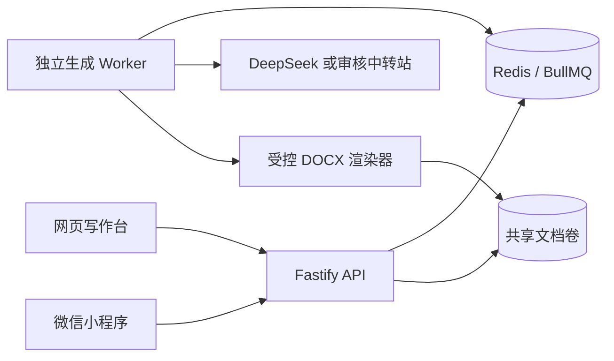

# 架构

## 运行拓扑

网页、小程序、API、Worker 是独立运行单元；二手书项目不在本仓库、不共享数据库或认证。两边只有用户主动触发的链接跳转。

## 生成链路

1. 客户端传入主题、要求、提纲和可选样式提示，并附带 `Idempotency-Key`。
2. API 使用 JWT 校验身份、按路由限流、使用 Zod 限制大小和字段范围后入队。
3. 本地没有 `REDIS_URL` 时使用内联队列，最多 `AI_MAX_CONCURRENCY` 个任务，仅用于开发和自动化测试。
4. 生产启用 Redis 后 API 只投递 BullMQ 任务，Worker 按 `WORKER_CONCURRENCY` 消费；完成和失败均由 BullMQ 管理重试和保留期。
5. provider 将模型响应约束为 `DocumentSpec` JSON 工具结果。契约校验失败不写出文件。
6. Word 渲染器统一应用论文样式：中文字体、标题层级、列表、表格、页边距、页眉页脚和页码，原子写入共享卷。
7. 下载 API 先校验任务归属和完成状态，再以流返回文件。

## 队列语义

- 每位用户最多 5 个等待或运行中的任务。
- 全局等待/运行/延迟任务上限 1000；超出返回 `429 QUEUE_CAPACITY`。
- 同一个用户重复提交相同 `Idempotency-Key` 会返回原任务。
- Redis job ID 是用户 ID 与幂等键的 SHA-256；内联模式使用 UUID。下载路由显式接受这两种格式。
- BullMQ 失败任务最多尝试 3 次，指数退避从 1.5 秒开始；成功结果保留 7 天，失败结果保留 30 天。

## 格式范本

DOCX 上传只用于提取段落、字体和页面样式建议，限制为一个 20 MiB 文件。解析器拒绝非 ZIP、过多条目、异常压缩比、过大解压内容和 DTD/entity 风险，不会执行范本内嵌内容。

当前网页端会把解析结果显示为本次浏览器会话中的范本；小程序端也可提取范本。两端都不会把未审核的 OOXML 直接作为最终文件模板。

## 功能状态

| 功能 | 状态 | 说明 |
| --- | --- | --- |
| AI 生成与 Word 导出 | 已实现 | DeepSeek、兼容中转站、Mock 三种路由 |
| 管理员总览 | 已实现 | JWT role 为 `admin` 才能访问 |
| 充值 | 关闭占位 | 未创建订单、账本或支付回调 |
| 查重 | 关闭占位 | 未上传论文，未调用任何检测接口 |
